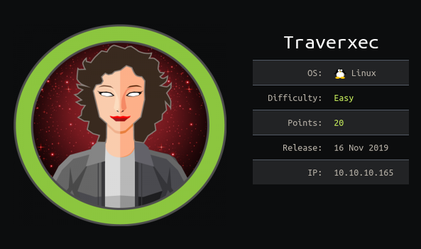

# Target

## Getting User
Let's start off with a simple nmap scan.

	nmap 10.10.10.165

Since there is a webserver running, let's enumerate it.

	dirb http://10.10.10.165/

While that is running, let's manually poke at it. One thing I try to do on every webserver is try and cause a 4XX error (404s are generally the easiest) to see what kind of debug info shows. Nine times out of ten, a server package name and version number will be included. If you browse to http://10.10.10.165/img/ you see "nostromo 1.9.6". 

If you Google "nostromo 1.9.6 exploit", this [Rapid7 article](https://www.rapid7.com/db/modules/exploit/multi/http/nostromo_code_exec) demonstrates how to exploit CVE-2019-16278.

As www-data, we should go investigate the webserver some more, now that we have a working shell. Starting with the configuration file (in /var/nostromo/conf/), we see the following.

        # MAIN [MANDATORY]

        servername              traverxec.htb
        serverlisten            *
        serveradmin             david@traverxec.htb
        serverroot              /var/nostromo
        servermimes             conf/mimes
        docroot                 /var/nostromo/htdocs
        docindex                index.html

        # LOGS [OPTIONAL]

        logpid                  logs/nhttpd.pid

        # SETUID [RECOMMENDED]

        user                    www-data

        # BASIC AUTHENTICATION [OPTIONAL]

        htaccess                .htaccess
        htpasswd                /var/nostromo/conf/.htpasswd

        # ALIASES [OPTIONAL]

        /icons                  /var/nostromo/icons

        # HOMEDIRS [OPTIONAL]

        homedirs                /home
        homedirs_public         public_www

A few things of note here:
- the server admin is someone named david
- there is a password file in /var/nostromo/conf/
- there is a public directory name public_www

You can crack the password, it is good practice, but it does not actually help on this box. I will show how at the end of the writeup, for now, let's see if there is a user named david

	grep david /etc/passwd

Sure enough there is, and his directory is /home/david. Since he is the admin, let's see if the public folder is in his directory.

	ls /home/david/public_www/

Now there is some real progress! Let's copy the backup-ssh-identity-files.tgz file to RAM and unpack them.

	cp /home/david/public_www/backup-ssh-identity-files.tgz /dev/shm/
	cd /dev/shm/
	tar -xvzf backup-ssh-identity-files.tgz

It creates a directory called home and in that directory is a SSH private key for david! If we try and use it, it requests a password. So, let's figure out what it is. We can use ssh2john to convert the RSA file to a file that John the Ripper (JtR) can understand. Let's find ssh2john and do this.

	(copy the private key to your attack box)
	sudo updatedb && locate *ssh2john*
	python /path/to/ssh2john.py id_rsa > david_ssh.hash
	john --wordlist=/usr/share/seclists/Passwords/Leaked-Databases/rockyou.txt david_ssh.hash

Great! We got "hunter" as the password, now let's login as david!

	ssh -i id_rsa david@10.10.10.165

user.txt is in /home/david

## Getting Root
Looking at the server status script, we notice that sudo is invoked at the end to call journalctl. Exploiting this is pretty straight forward. As according to the man page for journalctl, "The output is paged through less by default." Secondly, you can invoke commands from less. So, there we have our exploit.

Just make your terminal small enough for less to truncate the output, and then type "!bash" and press enter. As per the man page for less, the "!" invokes whatever follows as a shell command and since sudo invoked journalctl, when journalctl invokes a shell command, it is ran as root. Therefore, running "!bash" gives you a shell as root.

root.txt is in /root/

## Thank You Note
I would like to thank rub1ks for helping me get user on this box. There were a couple of firsts for me on this box and they gave me cryptic but very helpful hints. Mad respect and many thanks!

[rub1ks HTB profile](https://www.hackthebox.eu/home/users/profile/62851), show some love.

## Password Cracking the Rabbit Hole
Since it does not hurt to add to muscle memory, let's crack the password in /var/nostromo/conf/.htpasswd. Copy it to the attack box.

First, we need to identify the hash type.

	hashid .htpasswd

Returns three possible hashes.
- MD5 Crypt
- Cisco-IOS(MD5)
- FreeBSD MD5

Well, we can rule out FreeBSD and Cisco-IOS becuase this is a Linux target and it's for Nostromo. Let's throw rockyou at it. Copy just the hash into a file named hash and run the following command.

	hashcat -a 0 -m 500 hash /usr/share/seclists/Passwords/Leaked-Databases/rockyou.txt

That'll crack the hash. The string responsible is "Nowonly4me".
